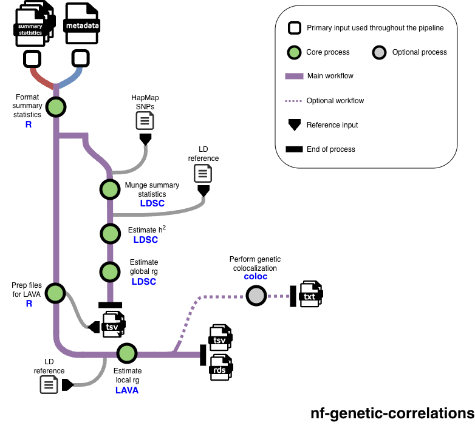

# Summary

Complex human traits and diseases are in part influenced by genetic variants across the full DNA sequence (the genome). Genome-wide association studies (GWAS) identify which genetic regions (loci) are statistically associated with the trait of interest. Many genomic regions or genes are associated with multiple traits, which is referred to as pleiotropy. Assessing genetic correlations between two traits (i.e. pairwise correlation at the level of genetic associations), can help identify pleiotropic regions, and provide etiological insights into shared biology between the tested traits `[@van Rheenen:2019; @bulik-sullivan_atlas_2015]`. Correlations can be assessed genome-wide (global genetic correlation) or at a locus by locus basis (local genetic correlation). The widespread availability of GWAS summary-level results has resulted in the possibility of testing the global and local genetic correlations across thousands of polygenic traits to uncover pleiotropy, using bioinformatic tools that require several inputs and varying formats of GWAS summary statistics. To facilitate the estimation of both global and local genetic correlations using two of the most common bioinformatic tools (i.e., Linkage Disequilibrium Score Regression [LDSC] and Local Analysis of covariant Association [LAVA]) `[@werme_integrated_2022; @bulik-sullivan_atlas_2015]`, we developed a Nextflow workflow named [nf-genetic-correlations](https://github.com/ape4fld/nf-genetic-correlations/tree/main), to automate both approaches. Additionally, our workflow also allows to perform genetic colocalization as a follow-up analysis, which aids to uncover shared causal variants within a genetic region across pairs of traits.

# Statement of need

The *nf-genetic-correlations* Nextflow pipeline performs global genetic correlations with LDSC and local genetic correlations with LAVA across as many traits as the user requires (minimum two traits). These two bioinformatic tools are widely and systematically used in human genetics research, but, to our knowledge, there is not an easy-to-use approach that combines both into one streamlined pipeline `[reynolds_local_2023; @lona-durazo_regional_2023; @kim_bidirectional_2024; @hu_global_2024; @liwayiding_unveiling_2025; @bright_genetics_2026; @wu_shared_2026; @zhang_genomic_2025]`. LDSC was originally built under Python 2, whereas LAVA is an R package. One of the main advantages of *nf-genetic-correlations* is that both LDSC and LAVA are downloaded by users as Apptainer containers with all dependencies needed, without the need of installing external libraries or dealing with version compatibility. Additionally, LAVA is automatically parallelized within our pipeline, which significantly decreases the usual running time, without the users needing to adapt their R scripts for the same purpose. In terms of the inputs, the user only needs to provide the GWAS summary statistics in a standard format (i.e., we use the column names as in the GWAS Catalog) and a metadata file that is used throughout the pipeline. Therefore, *nf-genetic-correlations* facilitates the work when performing genetic correlations across multiple traits, and outputs the customary readable text files for both LDSC and LAVA. Additionally, the pipeline can optionally streamline genetic colocalizations with the R package *coloc* `[@giambartolomei_bayesian_2014]`, which fully eliminates the installation, as well as the data and custom scripts preparation steps. Overall, *nf-genetic-correlations* reduces approximately ten times the computational time of the LAVA process by utilizing parallelization. Additionally, the pipeline is user-friendly, versatile, well documented and can be executed across different systems and environments, all of which enables users with different levels of bioinformatics expertise to perform global and local genetic correlations.

# State of the field                                                                                                                  

To our knowledge, the field lacks a unified framework that streamlines global and local genetic correlations, along with genetic colocalization into one automated pipeline, using two of the most common bioinformatics tools available for genetic correlations: LDSC and LAVA. Our nextflow pipeline *nf-genetic-correlations*  aims to fill this gap. Previous published studies (including our own work) `[reynolds_local_2023; @lona-durazo_regional_2023; @kim_bidirectional_2024; @hu_global_2024; @liwayiding_unveiling_2025; @bright_genetics_2026; @wu_shared_2026; @zhang_genomic_2025]` that have implemented both LDSC and LAVA used both approaches separately, which works well for a one-time specific project. However, in a research environment where GWAS results are constantly being updated and analyses need to be run many times across several traits, as is common in various human and population genetics research groups, a pipeline like *nf-genetic-correlations* becomes a practical option to quickly obtain results and reduce scripting and debugging times.

# Software design

*nf-genetic-correlations* was developed using Nextflow, one of the most widely used workflow management tools in bioinformatics, which allows the use of multiple programming languages interchangeably, including Python and R. Each process in the workflow is automatically run after the successful completion of the previous one, without requiring the user to intervene in between steps. A summary of the workflow is presented in Figure 1, and it consists on the following architecture:
1)	Formatting the GWAS summary statistics based on the metadata file that the user inputs, to be used for LDSC, LAVA and optionally colocalization.
2)	Munging the GWAS summary statistics for LDSC using the LDSC custom Python 2 script.
3)	Estimating the genetic heritability of each of the input traits with LDSC, followed by estimating the pairwise global genetic correlation with LDSC across all possible traits pairs.
4)	Preparing the sample overlap and metadata files for LAVA, which is generated after LDSC is completed (i.e. cannot be run in parallel with LDSC). LAVA requires the covariance estimates derived from LDSC to account for sample overlap in its assessment of local genetic correlations.
5)	Estimating local genetic correlations with LAVA (univariate and bivariate tests) in a parallelized manner across all pairs of traits, where 2,495 genomic regions are partitioned in 10 equal parts, as they are independent from each other. Importantly, the LAVA bivariate test is performed only for those pairs of traits which univariate test at that genomic region was significant using a Bonferroni-correction (*p*-value < 0.05/2,945) as it is suggested in the original LAVA publication `[@werme_integrated_2022]`. Additionally, the linkage disequilibrium (LD) reference used for LAVA is by default the UK Biobank reference (as recently suggested by LAVA developers) `[@de_leeuw_re-evaluating_2025]`, but the user can change it to use the 1000 Genomes EUR LD reference. When all ten LAVA partitions are completed, they will be merged into a single output readable file.
6)	If the user opted to perform genetic colocalizations, the process begins for those pairs of traits which were significant in the LAVA bivariate test. By default, the significance threshold is defined by having a *p*-value < 0.05, but the user can adjust the threshold.
7)	Finally, intermediate files are deleted and only the final results from each of the main steps of the pipeline are retained: LDSC heritability and global genetic correlations, LAVA univariate and bivariate tests, and, optionally, genetic colocalization results. However, the user can opt to keep intermediate files as well.

The pipeline is designed so that users do not need to edit or adapt the Nextflow file (main_full.nf) where the workflow and all processes are described. Instead, the user can change certain settings by using optional flags in the executed Nextflow command. Therefore, users do not need to be proficient in Nextflow to use *nf-genetic-correlations*. The Nextflow configuration file (nextflow.config) includes minimal parameters that need to be adapted depending on the environment and system the user is using, which are all clearly explained in the Github repository. Finally, the Github repository also includes an example of how to execute the pipeline using a SLURM workload manager (run_nextflow.sh).

# Research impact statement

The pipeline was initially developed for internal use purposes, as repeated analyses across dozens of GWAS summary statistics had become a systematic task. Since then, new members of our research group (junior and senior level) have tested and successfully utilized the pipeline, without having previously used any of the tools contained in the pipeline, in short time. The pipeline has been available as a public Github repository since July 2025 and it has already been starred by external Github users, attesting to its utility for the field. We foresee that our pipeline will become the go-to approach for computational genetics researchers who may want to include genetic correlations as primary or secondary analysis to answer their research questions using GWAS summary statistics. Additionally, our pipeline facilitates the implementation of these tools by a diverse set of researchers, including clinician-scientists, who may not have sufficient expertise in bioinformatics to run genetic correlation analyses using the original tools as is.

# AI usage disclosure

Generative AI (Claude Code) was used to create the R environment Apptainer image, followed by tests across different test users and system environments to ensure its functionality. Generative AI (Claude Code) was also used to create a draft of the documentation available on Github, which was then manually updated and improved by the authors.

# Acknowledgements

The authors acknowledge the Digital Research Alliance of Canada for providing high-performance computing resources to develop the pipeline.

# References